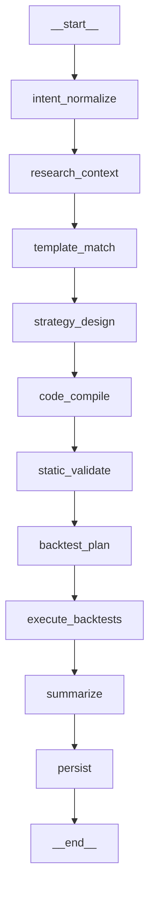
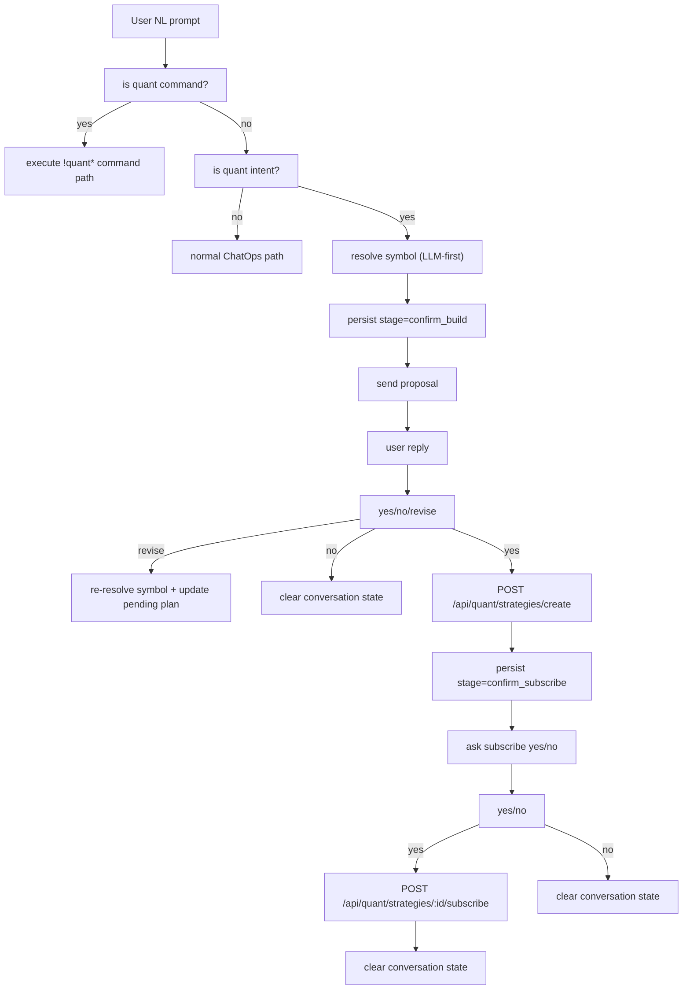
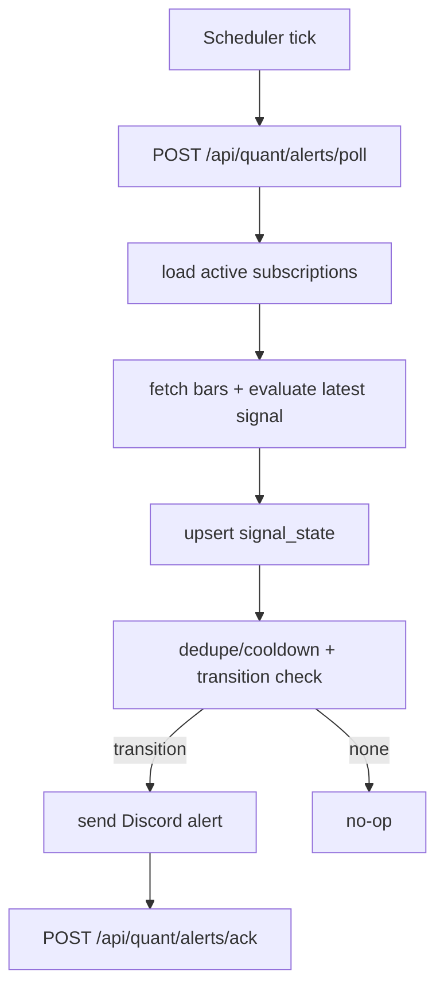
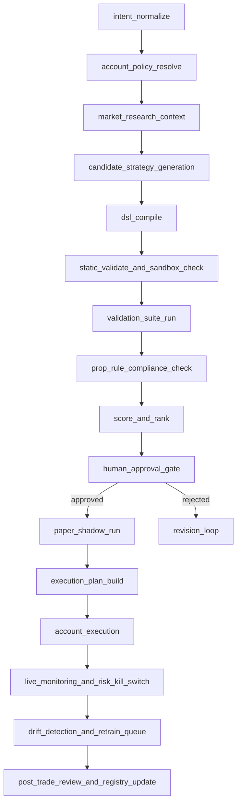
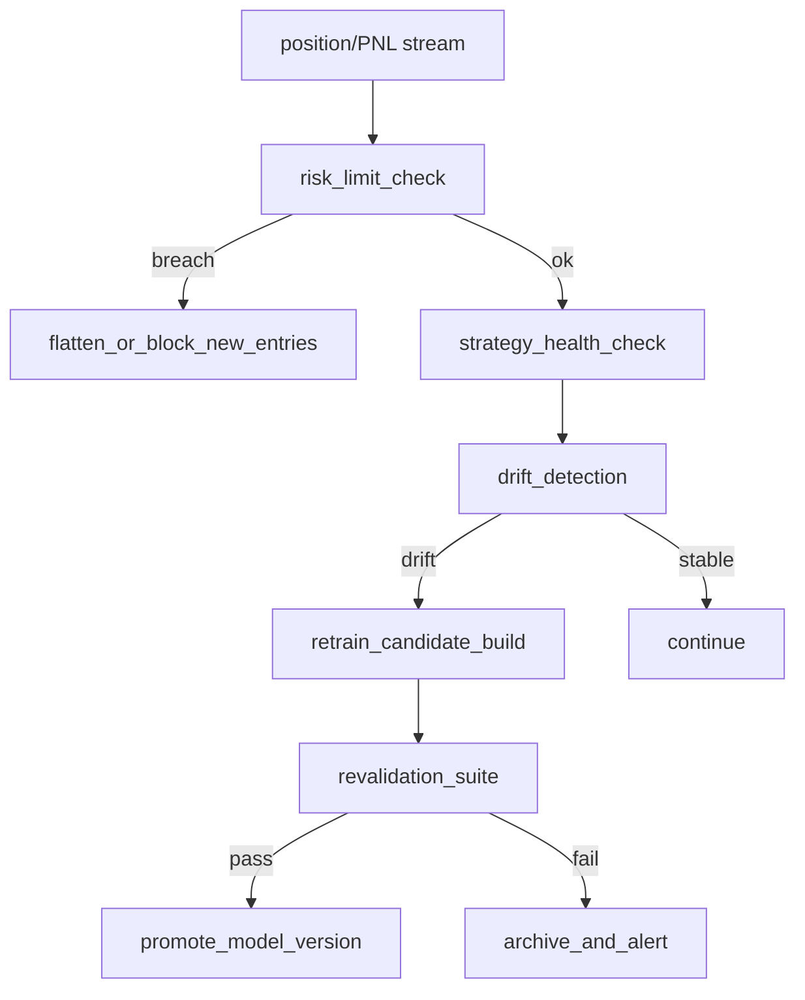

# Quant Agentic System: Exact Agent Graphs

## Scope
This document defines graph topology for:
- Quant Strategy Factory (user-facing, current + target).
- Internal Prop System (admin-only, target).

There is a single strategy build mode (`standard`). OOS, walk-forward, and Monte Carlo are default requirements.

## 1) Quant Strategy Factory: Current Build Graph (Exact Node IDs)
Source: `apps/orchestrator/src/quantFactory/workflow.ts`.

### Node responsibilities
- `intent_normalize`: normalize prompt/request into `QuantStrategyRequest`.
- `research_context`: event risk + news + macro + research specialist synthesis.
- `template_match`: choose best template family using prompt + context.
- `strategy_design`: strategy specialist + codegen specialist produce concrete DSL.
- `code_compile`: DSL -> deterministic Python artifact + hashes.
- `static_validate`: lint and policy checks.
- `backtest_plan`: persist strategy/version, create run row, fetch bars.
- `execute_backtests`: IS/OOS + WF + MC + sensitivity + gate.
- `summarize`: backtest analyst summary.
- `persist`: persist report, finalize run, update strategy status.

## 2) Quant Strategy Conversation Graph (Current `/query` + Chart Chat + Discord)
Source: `apps/orchestrator/src/index.ts`, `apps/web/src/app/charting/page.tsx`, `apps/orchestrator/src/discord-server/src/bot/discordBot.ts`.

Notes:
- Conversation state has DB persistence with in-memory cache fallback and 15-minute TTL.
- Pre-confirmation symbol resolution uses backend LLM-first resolver with heuristic/regex fallback.

## 3) Quant Alerts Graph (Current)
Source: `apps/orchestrator/src/quantFactory/service.ts`, Discord bot scheduler.

## 4) Internal Prop System: Target Build/Deploy Graph (Admin-only)
This is the recommended deterministic graph for the separate prop pipeline.

## 5) Internal Prop System: Continuous Monitoring Graph (Target)

## 6) Agent roster by graph
- Quant Strategy Factory agents:
  - `ResearchAgent`
  - `StrategyDesignerAgent`
  - `CodegenAgent`
  - `BacktestAnalystAgent`
- Prop System agents (target):
  - `PropPolicyAgent`
  - `ResearchAgent`
  - `CandidateGeneratorAgent`
  - `ValidationAnalystAgent`
  - `ExecutionPlannerAgent`
  - `RiskSentinelAgent`
  - `DriftAndRetrainAgent`

All numeric market outputs must come from tools/engines, not free-form model text.
