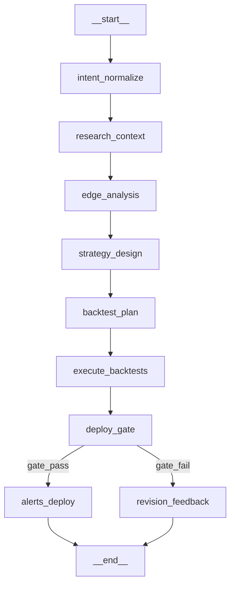
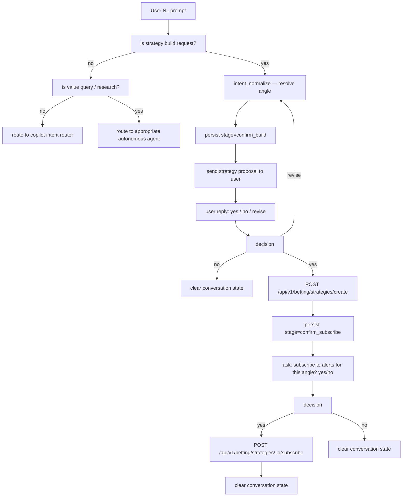
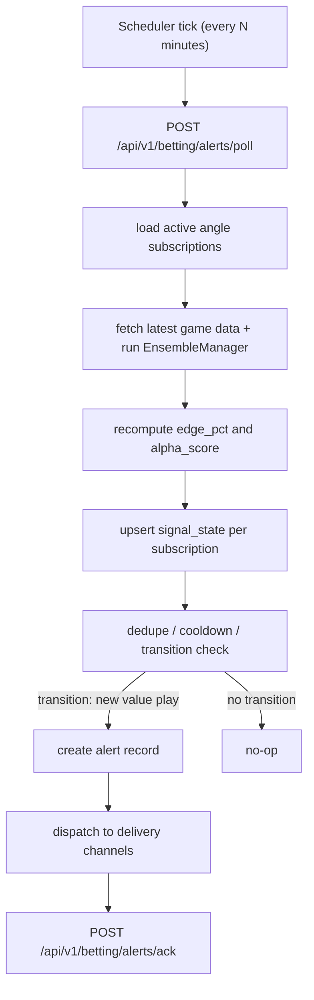

# Sports Betting Agent Architecture

## Scope

This document defines the expanded agentic architecture for SharpEdge, applying FinnAI's quant factory
patterns to the sports betting and prediction markets domain. It covers:

- Sports Betting Strategy Graph (parallel to `01_AGENT_GRAPHS.md` quant factory)
- Autonomous agent roster with responsibilities
- Copilot intent routing design
- Alert system design with full lifecycle
- API surface needed
- Key implementation decisions
- Phase plan

The existing copilot (`POST /api/v1/copilot/chat`) and value-plays pipeline are the foundation.
This architecture layers structured agent workflows on top of that foundation without replacing it.

---

## 1. Sports Betting Strategy Graph

This graph mirrors the Quant Strategy Factory graph from `01_AGENT_GRAPHS.md`. The same principles
apply: deterministic node execution, quality gates before deployment, explicit support classification,
and alerts-first subscription flow after gate passage.

### 1.1 Build Graph



### 1.2 Node Responsibilities

**`intent_normalize`**

Parses the user's natural-language betting query into a structured `BettingStrategyRequest`.
Output fields:
- `sport`: nba | nfl | mlb | nhl | ncaab | prediction_markets
- `market_type`: moneyline | spread | total | player_prop | same_game_parlay
- `target_side`: team name or player name
- `constraints`: max_stake_pct, min_edge_pct, max_parlay_legs
- `time_horizon`: today | this_week | season
- `build_mode`: value_scan | strategy_build | research_only | unsupported_now

Mirrors `intent_normalize` in the quant factory. Emits `needsClarification=true` when the request
is ambiguous (e.g. "build me something that wins"). Does not hallucinate sport or market from
underspecified input.

**`research_context`**

Assembles betting-relevant context for the target game or angle. Sources:
- Injury reports (official league sources)
- Line movement history (opening line vs current, velocity)
- Sharp money indicators (reverse line movement, steam moves)
- Public betting percentage (fade-the-public signals)
- Historical matchup splits (ATS, O/U record at venue)
- Weather conditions (for outdoor sports)
- Rest and travel (back-to-back, time zone disadvantage)
- Venue-specific calibration data from `CalibrationStore`

All numeric values must come from tools and stored data, not free-form model generation.

**`edge_analysis`**

Core quantitative step. Computes:
- `model_probability`: output of `EnsembleManager` for this game/market
- `implied_probability`: derived from best available market odds (no-vig conversion)
- `edge_pct`: `model_probability - implied_probability`
- `confidence_mult`: from `CalibrationStore` (Platt-calibrated per sport and venue family)
- `alpha_score`: composite score using edge, confidence, and regime state
- `alpha_badge`: PREMIUM | HIGH | MEDIUM | SPECULATIVE (mirroring existing badge thresholds)

Outputs `edge_sufficient=true` only when `edge_pct >= min_edge_threshold` AND
`alpha_badge` is at least MEDIUM. Below threshold, emits `unsupported_now` with nearest
supported path guidance.

**`strategy_design`**

Produces a concrete `BettingStrategy` artifact:
- Kelly stake recommendation (full Kelly, fractional Kelly at 0.25/0.5x, or flat unit)
- Bankroll percentage based on current exposure state
- Recommended book(s) for best price
- Hedge or middle opportunity flag if cross-venue dislocation detected
- Correlated-leg warning for parlays (blocks highly correlated same-game-parlay combinations)
- Unit size in dollars given current bankroll from `get_exposure_status`

Output is deterministic given the same input. No unconstrained LLM sizing recommendations.

**`backtest_plan`**

Retrieves historical performance for the specific betting angle:
- Filter from `resolved_pm_markets` or sports results tables by sport, market type, and angle
- Compute win rate, ROI after juice, max losing streak, and Sharpe-equivalent (edge stability)
- Walk-forward slice: last 30 days, last 90 days, full historical window
- Regime breakdown: how does this angle perform in different regime states

**`execute_backtests`**

Runs the full validation suite:
- In-sample / out-of-sample split (70/30 with minimum trade floor)
- Walk-forward slices (non-overlapping 30-day windows)
- Cost sensitivity: vary juice assumption ±20%
- Drawdown analysis: max losing streak and recovery time
- Benchmark comparison: vs. naive public-side betting
- Overfit diagnostics: parameter sensitivity across angle variants
- Quality gate check

**`deploy_gate`**

Enforces minimum robustness standards before alerts subscription is permitted. Gate passes only if:
- `edge_pct >= 2.0%` on out-of-sample window
- Win rate >= implied break-even (accounting for juice) on OOS
- Walk-forward stability: no window with ROI < -15%
- Quality badge: `high` or `excellent`
- Maximum drawdown within configured limit
- Minimum 30-game historical sample exists for this angle

Gate failure returns structured feedback for revision. No silent promotion.

**`alerts_deploy`**

Creates an active subscription for this betting angle:
- Persists `BettingAngleSubscription` row with strategy artifact and gate metadata
- Registers angle in the alert polling loop (`POST /api/v1/betting/alerts/poll`)
- Sends confirmation to user: angle name, edge %, stake recommendation, poll frequency
- Sets cooldown to prevent duplicate alerts on the same game

**`revision_feedback`**

When deploy gate fails, returns structured feedback:
- Which gate checks failed and by how much
- Nearest passing configuration (tighter constraints, different market type, larger sample)
- Whether the angle is `unsupported_now` permanently or just needs more data

---

## 2. Betting Conversation Graph

Mirrors the Quant Strategy Conversation Graph from `01_AGENT_GRAPHS.md`. This is the interaction
layer that sits between the user's chat input and the strategy build graph.



Conversation state follows the same DB-persistence-with-in-memory-cache pattern as the quant
factory: 15-minute TTL, keyed by user session.

---

## 3. Betting Alerts Graph

Mirrors the Quant Alerts Graph from `01_AGENT_GRAPHS.md`. Scheduler polls active angle
subscriptions and evaluates for new signal transitions.



---

## 4. Autonomous Agent Roster

These agents run continuously as scheduled background workers (via `asyncio.create_task` in the
lifespan, mirroring the existing `result_watcher` and `alert_poster` jobs). Each agent has a
single clear responsibility.

### ValueScoutAgent

**Responsibility:** Continuously scans all active games for positive expected value opportunities.

Cycle:
1. Fetch all games with `game_start_time` in the next 48 hours from the database.
2. For each game and applicable market types, run `EnsembleManager` to get model probability.
3. Fetch current market odds via the existing odds scanner infrastructure.
4. Compute `edge_pct = model_probability - implied_probability` with `CalibrationStore` confidence.
5. Any game-market combination with `edge_pct >= threshold` and `alpha_badge >= MEDIUM` is a candidate.
6. Persist candidate to `value_plays` table (existing schema — no schema change needed).
7. If alpha badge is PREMIUM or HIGH, trigger alert creation.

Poll interval: configurable, default 5 minutes during game days, 30 minutes otherwise.
Does not write to `value_plays` if an identical record (same game, market, side, similar edge)
exists within the cooldown window.

### LineMovementAgent

**Responsibility:** Detects sharp line movement that indicates professional action.

Sharp move criteria (configurable thresholds):
- Line moves >= 1.5 points (spread) or >= 10 cents (moneyline) against the public side
- Volume spike > 2x average for the game at that point in time
- Reverse line movement: majority public on one side but line moving the other way

Cycle:
1. Poll the odds scanner for all active game lines every 2 minutes.
2. Compare current line to opening line and to line 30 minutes ago.
3. Classify as `steam_move`, `reverse_line_movement`, or `significant_shift`.
4. For confirmed sharp signals, create a `line_movement_sharp` alert.
5. Enrich the copilot context: when a user asks about an affected game, the sharp-move signal
   is surfaced automatically in `research_context`.

### ArbitrageAgent

**Responsibility:** Detects cross-book arbitrage windows where backing both sides guarantees profit.

Cycle:
1. For each active game, collect best available odds for all outcomes across tracked books.
2. Compute implied probability sum for each outcome set.
3. If sum < 1.0 (after juice), a true arbitrage exists.
4. Filter by minimum guaranteed profit threshold (default 0.5% after fees).
5. Create `arb_window_open` alert with: book A side A price, book B side B price, stake split,
   guaranteed profit pct, and window expiry estimate.

Note: arbitrage windows typically close in minutes. Alert delivery must be low-latency.
Alert includes explicit expiry warning. Do not alert on windows narrower than the minimum
stake round-trip time.

### BankrollAdvisorAgent

**Responsibility:** Monitors bankroll exposure and flags over-exposure or kelly sizing errors.

Continuous monitoring:
1. Watch `ledger_entries` table for new bet records.
2. After each new bet, recompute total exposure across all open positions.
3. Compute Kelly-optimal stake for each open bet given current `alpha_score` and `edge_pct`.
4. Flag bets where actual stake exceeds 2x Kelly as `over_kelly_threshold`.
5. Flag when total open exposure exceeds configurable bankroll percentage (default 20%).
6. Create `bankroll_threshold_breach` alert if breach detected.

Advisory (not blocking): agent records breach alerts and surfaces them in copilot context.
Does not reject or cancel bets.

Periodic report: every 24 hours, generates bankroll health summary:
- Total bankroll, total exposure, exposure pct
- Count of open bets above Kelly threshold
- Estimated variance (based on open bet win probabilities)
- Monte Carlo fan chart data (feeds existing `POST /api/v1/bankroll/simulate`)

### PredictionMarketAgent

**Responsibility:** Monitors Kalshi and Polymarket for resolution signals and cross-venue
dislocation opportunities.

Cycle:
1. Fetch active prediction markets from `resolved_pm_markets` table (existing schema from Phase 10).
2. Run `CrossVenueDislocDetector` (existing Phase 6 tool) to find dislocation between Kalshi,
   Polymarket, and sportsbook-implied probabilities.
3. For dislocated markets above threshold, surface as value opportunity to `value_plays`.
4. Monitor markets approaching resolution (time-to-close < 2 hours) for final-leg arbitrage.
5. After resolution, write resolved outcome to `resolved_pm_markets` and trigger any
   `prediction_market_resolution` alerts for users subscribed to that market.

---

## 5. Copilot Intent Routing

The existing copilot route (`POST /api/v1/copilot/chat`) streams responses from a LangGraph
agent with 12 tools. Intent routing adds a classification step before the graph runs, so the
correct agent or sub-graph handles each query type.

### 5.1 Intent Classes

| Intent Class | Example Queries | Handler |
|---|---|---|
| `value_play_query` | "best value bet tonight", "any edges on NBA tonight", "what's the sharpest play right now" | ValueScoutAgent results from DB |
| `sizing_query` | "how much should I bet?", "what's my kelly on this?", "am I over-exposed?" | BankrollAdvisorAgent + bankroll state |
| `research_query` | "tell me about Lakers vs Celtics tonight", "injury news for Patrick Mahomes", "what's the weather for the Bills game" | ResearchAgent (research_context node) |
| `strategy_build` | "build me a betting system for NBA spreads", "create an angle for fade-the-public NBA totals", "set up alerts for steam moves on NFL" | Full strategy build graph |
| `prediction_market` | "what are the odds the Fed cuts rates in March?", "Kalshi price on the election", "is there value on the Polymarket contract?" | PredictionMarketAgent |
| `line_movement_query` | "has the line moved on this game?", "any sharp action tonight?", "what's causing this line movement?" | LineMovementAgent context |
| `arb_query` | "any arbitrage opportunities right now?", "cross-book edges tonight" | ArbitrageAgent results |
| `general` | anything that does not match above patterns | Standard LLM response using existing tools |

### 5.2 Router Node Design

The router is a single lightweight node inserted before the main copilot graph handles the
message. It classifies intent using the message text and recent conversation state.

```
classify_intent(message, conversation_state) -> IntentClass

Router decision tree:
1. If conversation_state has pending strategy build → continue strategy build conversation
2. Check explicit command patterns (contains "build me a system", "create an angle") → strategy_build
3. Check question patterns:
   - Contains sizing/kelly/exposure keywords → sizing_query
   - Contains line movement/sharp/steam keywords → line_movement_query
   - Contains arbitrage/arb/cross-book keywords → arb_query
   - Contains prediction market/Kalshi/Polymarket keywords → prediction_market
   - Contains research/injury/weather/matchup keywords → research_query
   - Contains value/edge/best bet/tonight keywords → value_play_query
4. Default → general
```

Classification does not use a separate LLM call for common patterns. Regex + keyword matching
handles 80% of cases. An LLM call is reserved for ambiguous inputs where keyword patterns
conflict or confidence is low.

### 5.3 Clarification Behavior

When intent is `strategy_build` but the request is underspecified, the router returns a
clarification prompt before starting the build graph. Required fields that trigger clarification:
- Sport not specified
- Market type not specified
- No meaningful angle described (e.g. "build me something that wins")

Mirrors the quant factory's `needsClarification=true` behavior exactly.

---

## 6. Alert System Design

### 6.1 Alert Types

| Alert Type | Trigger | Priority |
|---|---|---|
| `value_play_detected` | ValueScoutAgent finds edge >= threshold with badge >= MEDIUM | HIGH for PREMIUM, NORMAL for others |
| `line_movement_sharp` | LineMovementAgent detects steam move or reverse line movement | HIGH |
| `arb_window_open` | ArbitrageAgent finds cross-book arb >= min profit threshold | URGENT (time-sensitive) |
| `bankroll_threshold_breach` | BankrollAdvisorAgent detects over-exposure or over-kelly bet | HIGH |
| `prediction_market_resolution` | PredictionMarketAgent sees contract resolve | NORMAL |
| `strategy_gate_pass` | Betting angle passes deploy gate after strategy build | NORMAL |
| `strategy_gate_fail` | Betting angle fails deploy gate — feedback available | LOW |

### 6.2 Alert Lifecycle

Mirrors the quant factory poll/ack pattern exactly:

```
created → pending_delivery → delivered → acked
```

- `created`: alert record written to `betting_alerts` table with all context fields
- `pending_delivery`: dispatcher picks up undelivered alerts every N seconds
- `delivered`: at least one delivery channel confirmed receipt
- `acked`: user explicitly acknowledged (in-app dismiss, mobile notification open)

Alerts that fail all delivery channels after 3 retries move to `delivery_failed` state. They
are still visible in the in-app feed.

Deduplication: alerts with the same `(alert_type, game_id, market_type, side)` within the
cooldown window are suppressed. Cooldown is configurable per alert type (default: 30 minutes
for value plays, 5 minutes for arb windows, 60 minutes for bankroll breach).

### 6.3 Delivery Channels

Three delivery channels, evaluated in priority order:

**Push notification (mobile):** Highest priority for URGENT and HIGH alerts. Uses existing FCM
infrastructure from `POST /api/v1/users/{user_id}/device-token`. Payload includes:
`alert_type`, `title`, `body`, `deep_link` (e.g. to the relevant game or play page).

**In-app feed (web and mobile):** All alerts appear in the in-app feed regardless of delivery
channel outcome. The feed is the source of truth for alert history. Implemented as a live-query
on the `betting_alerts` table via Supabase Realtime. No polling required.

**Discord:** Existing `discord_client` infrastructure. Formats alert as an embed with edge %,
stake recommendation, and link to full analysis. Used for community-visible HIGH and PREMIUM alerts.

Email is not in scope for Phase 11 (current alert infrastructure covers push + feed + Discord
which matches existing patterns).

### 6.4 Alert Schema

```sql
CREATE TABLE betting_alerts (
    id            UUID PRIMARY KEY DEFAULT gen_random_uuid(),
    user_id       UUID REFERENCES auth.users(id),   -- NULL for broadcast alerts
    alert_type    TEXT NOT NULL,
    priority      TEXT NOT NULL DEFAULT 'NORMAL',   -- URGENT | HIGH | NORMAL | LOW
    status        TEXT NOT NULL DEFAULT 'created',  -- created | pending_delivery | delivered | acked | delivery_failed
    game_id       TEXT,
    sport         TEXT,
    market_type   TEXT,
    side          TEXT,
    edge_pct      NUMERIC(6,4),
    alpha_score   NUMERIC(6,4),
    alpha_badge   TEXT,
    stake_rec     NUMERIC(10,2),                    -- recommended stake in dollars
    payload       JSONB NOT NULL DEFAULT '{}',       -- full alert context
    delivered_at  TIMESTAMPTZ,
    acked_at      TIMESTAMPTZ,
    created_at    TIMESTAMPTZ NOT NULL DEFAULT NOW(),
    expires_at    TIMESTAMPTZ,                       -- for arb windows that expire

    INDEX idx_status (status),
    INDEX idx_user_alert (user_id, created_at DESC),
    INDEX idx_type_status (alert_type, status)
);
```

---

## 7. API Endpoints

### 7.1 Strategy Lifecycle (mirrors quant factory API surface)

```
POST   /api/v1/betting/strategies/create
         Body: { message: str, session_id?: str }
         Returns: BettingStrategyResponse (strategy artifact, gate result, candidate metadata)

POST   /api/v1/betting/strategies/:id/backtest
         Reruns backtest for a stored strategy angle.

GET    /api/v1/betting/strategies/:id/runs/:runId
         Returns run detail and attached backtest report.

POST   /api/v1/betting/strategies/:id/subscribe
         Creates alerts subscription for a gate-passed strategy angle.
```

### 7.2 Alerts Lifecycle (mirrors quant factory alerts API)

```
POST   /api/v1/betting/alerts/poll
         Evaluates active subscriptions for new signal transitions.
         Called by scheduler; can also be called manually for testing.

POST   /api/v1/betting/alerts/ack
         Body: { alert_id: str }
         Marks alert as acked.

GET    /api/v1/betting/alerts
         Query: user_id, status, alert_type, limit
         Returns alert feed for the authenticated user.
```

### 7.3 Autonomous Agent Queries (read-only, sourced from agent state)

```
GET    /api/v1/agents/value-scout/results
         Query: sport, min_edge, min_alpha, limit
         Returns current ValueScoutAgent candidates (same shape as /api/v1/value-plays).

GET    /api/v1/agents/line-movement/alerts
         Query: sport, game_id
         Returns recent LineMovementAgent detections.

GET    /api/v1/agents/arbitrage/windows
         Returns open ArbitrageAgent windows (time-sensitive; short TTL response).

GET    /api/v1/agents/bankroll/advisory
         Requires auth. Returns BankrollAdvisorAgent advisory for the current user.

GET    /api/v1/agents/prediction-markets/signals
         Query: market_id, category
         Returns PredictionMarketAgent current signals and dislocation data.
```

### 7.4 Copilot Intent Routing (extends existing endpoint)

The existing `POST /api/v1/copilot/chat` endpoint is extended to accept an optional
`intent_override` field. The router node runs as the first step in the graph and emits
`intent_class` in the response metadata. No breaking change to the existing SSE protocol.

```
POST   /api/v1/copilot/chat
         Body: { message: str, session_id?: str, intent_override?: str }
         Response: SSE stream (unchanged protocol)
         Headers include: X-Intent-Class: <classified intent>
```

---

## 8. Key Implementation Decisions

### 8.1 Extend the existing graph rather than replace it

The current `BettingCopilot` graph (`sharpedge_agent_pipeline.copilot.agent`) has 12 tools
and is already streaming via SSE. The strategy build graph is a separate graph that can be
invoked from within the copilot when `intent_class == strategy_build`. This avoids breaking
the existing chat flow.

Pattern: the copilot graph's `strategy_build` branch calls `build_betting_strategy_graph()`
and streams its events through the same SSE protocol. Same event format, same frontend code.

### 8.2 Autonomous agents as asyncio tasks, not separate services

Mirroring `result_watcher` and `alert_poster` (existing background jobs in `main.py lifespan`),
autonomous agents run as `asyncio.create_task` within the FastAPI process. This avoids
infrastructure overhead for Phase 11. Each agent is a coroutine with a configurable poll interval.

When the agent workload grows beyond what a single FastAPI process can handle, they can be
extracted to Celery workers or a dedicated agent service. That extraction is a later phase concern.

### 8.3 All numeric outputs come from tools and engines

Following the quant factory rule: "All numeric market outputs must come from tools/engines, not
free-form model text." Applied to sports betting:
- Model probability always from `EnsembleManager` (not LLM estimation)
- Implied probability always from parsed market odds (not LLM estimation)
- Kelly stake always computed by `BankrollAdvisorAgent` using the formula
- Historical win rate always from resolved results tables

The LLM in the copilot graph is responsible for synthesis, explanation, and conversation —
not for generating numbers that would otherwise require computation.

### 8.4 Gate semantics for sports betting

The deploy gate for betting angles is intentionally more conservative than for quant strategies,
because sports betting has inherently smaller edge (2-5% typical) versus equities (20%+ Sharpe
strategies). Gate thresholds:

- Minimum edge: 2.0% (lower than quant strategies because sports edges are structurally smaller)
- Minimum sample: 30 resolved games for the specific angle (not 1-2 backtests)
- Walk-forward stability: no 30-day window with ROI < -15%
- Quality badge: `high` or `excellent`

Gate semantics are versioned (following the quant factory pattern). Any threshold change gets
a new version date. Current version: `2026-03-15-sports-gate-v1`.

### 8.5 Capability classification for unsupported requests

Following the quant factory pattern, the `intent_normalize` node explicitly classifies:
- `supported`: angle is computable with current model and data pipeline
- `unsupported_now`: angle requires data or models not yet available
  (e.g., live in-game betting, player prop models not yet trained)

Unsupported requests return structured guidance: nearest supported path, what data would
be needed, and an estimated phase when support is planned.

### 8.6 Prediction market agent reuses Phase 10 schema

The `PredictionMarketAgent` writes to and reads from `resolved_pm_markets` (Phase 10 DDL).
No new tables needed. The existing `CrossVenueDislocDetector` (Phase 6) provides the
dislocation signals. The agent's job is scheduling and alerting, not new computation.

### 8.7 Copilot intent router uses keyword-first, LLM-fallback

A full LLM call for every message to classify intent adds ~500ms latency and ~$0.0002 per
message. The router uses a keyword + regex classifier for the 80% of cases that are
unambiguous. Only messages that score below a confidence threshold (conflicting signals or
no keywords matched) make an LLM classification call.

This matches FinnAI's 3-tier model routing principle: use the cheapest handler that meets
the accuracy bar.

---

## 9. Phase Plan

### Phase 11 — Core Agent Infrastructure (Build First)

Priority: establish the scaffolding that all subsequent capabilities depend on.

Deliverables:
- `intent_normalize` node: `BettingStrategyRequest` schema, clarification behavior
- `research_context` node: assemble game context from existing data sources
- `edge_analysis` node: wire `EnsembleManager` + `CalibrationStore` into a single edge compute step
- Copilot intent router: keyword classifier with LLM fallback
- `betting_alerts` table migration
- `POST /api/v1/betting/alerts/poll` and `POST /api/v1/betting/alerts/ack` endpoints
- `ValueScoutAgent` as asyncio task (simplest autonomous agent — read-only, well-defined output)
- Alert delivery to in-app feed via Supabase Realtime

Depends on: Phase 10 (`resolved_pm_markets` DDL), Phase 7 (trained `EnsembleManager`)

### Phase 12 — Full Strategy Build Graph

Deliverables:
- `strategy_design` node: Kelly sizing, unit sizing, stake recommendation
- `backtest_plan` node: historical angle lookup and walk-forward slice
- `execute_backtests` node: full validation suite with walk-forward and cost sensitivity
- `deploy_gate` node with versioned threshold semantics
- `alerts_deploy` node: subscription creation
- `POST /api/v1/betting/strategies/create` endpoint
- `POST /api/v1/betting/strategies/:id/subscribe` endpoint
- Betting conversation graph with confirm-then-subscribe flow
- Prompt stress suite for sports betting (mirrors `11_QUANT_FACTORY_E2E.md` prompt suite)

Depends on: Phase 11

### Phase 13 — Autonomous Agent Expansion

Deliverables:
- `LineMovementAgent`: sharp move detection, steam move classification
- `ArbitrageAgent`: cross-book arb window detection
- `BankrollAdvisorAgent`: exposure monitoring, over-Kelly flagging, 24h advisory report
- `PredictionMarketAgent`: Kalshi/Polymarket dislocation + resolution monitoring
- `GET /api/v1/agents/*` read endpoints for each agent
- Alert delivery: push notifications via FCM (extends existing device token infrastructure)
- Alert delivery: Discord embeds (extends existing `discord_client`)

Depends on: Phase 11, Phase 12

### Phase 14 — Prediction Market Strategy Graph

Deliverables:
- Extend the strategy build graph for prediction market angles (not just sports)
- `PredictionMarketAgent` strategy subscriptions with poll/ack
- Resolution signal integration into the copilot conversation graph
- Cross-venue strategy: sport game outcome correlated with prediction market contract

Depends on: Phase 13, Phase 9 (Kalshi/Polymarket resolution models)

---

## Appendix: Agent Roster Summary

| Agent | Type | Poll Interval | Output | Gate Required |
|---|---|---|---|---|
| ValueScoutAgent | Background task | 5 min (game day), 30 min (off day) | `value_plays` rows + `value_play_detected` alerts | No (read-only scanning) |
| LineMovementAgent | Background task | 2 min | `line_movement_sharp` alerts + research context enrichment | No |
| ArbitrageAgent | Background task | 2 min | `arb_window_open` alerts | No |
| BankrollAdvisorAgent | Event-driven + 24h periodic | On `ledger_entries` insert | `bankroll_threshold_breach` alerts + advisory report | No |
| PredictionMarketAgent | Background task | 15 min | PM dislocation signals + `prediction_market_resolution` alerts | No |
| StrategyBuildGraph | On-demand (user-triggered) | N/A | `BettingStrategy` artifact + gate result | Yes (deploy_gate node) |

---

*Document created: 2026-03-15*
*Companion to `01_AGENT_GRAPHS.md` — applies quant factory patterns to sports betting domain.*
